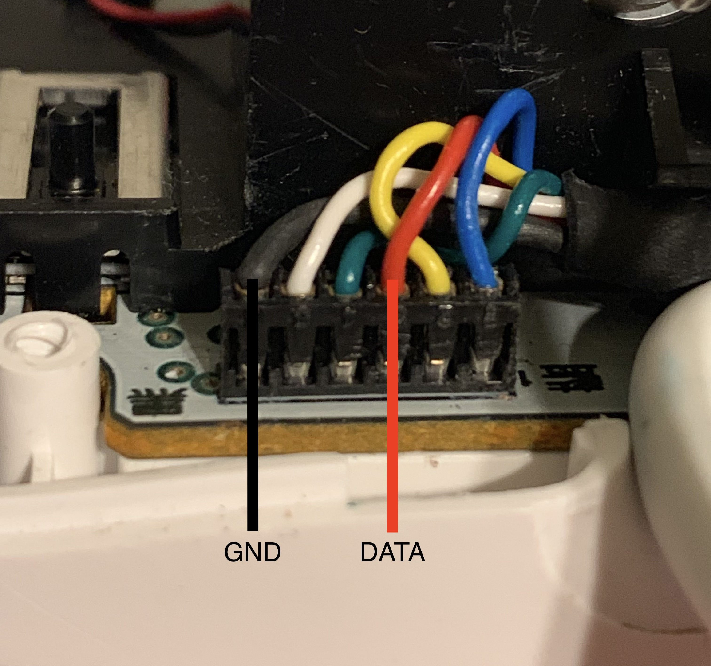
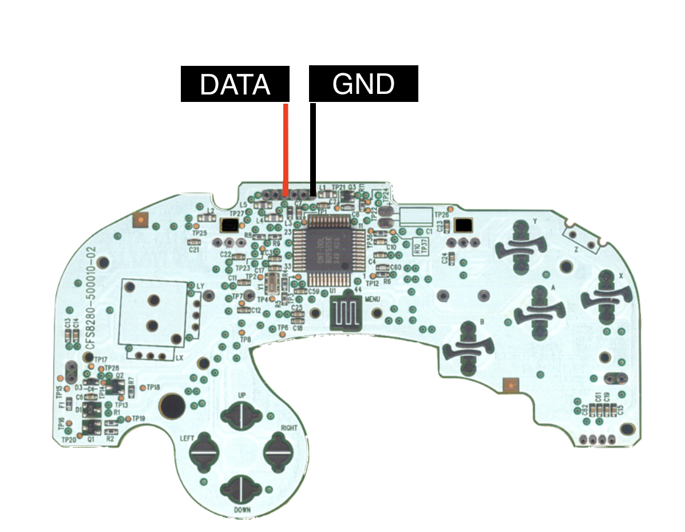

# BlueCubeMod

ESP32 based GameCube Controller Bluetooth conversion for Nintendo Switch

v1:
Mac/PC/PS4 supported (tested using Dolphin Emulator on Mac, for Switch/RaspberryPi, use an 8Bitdo USB adapter)

v2: 
Switch support only - no adapter required

## Wiring:

- Connect pins 23 and 18 to GameCube controller's data pin (Red)

- Connect GND to controller's ground pin (Black)

## Build instructions(v2):

- Use this esp-idf fork here: https://github.com/NathanReeves/esp-idf

- Set up the esp-idf environment: https://docs.espressif.com/projects/esp-idf/en/latest/get-started/

- Get the BlueCubeModv2 firmware

- If you haven’t flashed an ESP32 project before, you need the port name of ESP32 for the config file. If using unix system, to get the port name of a USB device run:

`ls /dev`

- Find your device on the list and copy it. It should look something like: /dev/cu.usbserial-DO01EXOV or /dev/cu.SLAB_USBtoUART

- cd into project folder and run:

`make menuconfig`

- Paste your port name into Serial Flasher Config -> Default Serial Port

- Compile and flash the program, run:

`make flash monitor`

Resources used:

http://www.int03.co.uk/crema/hardware/gamecube/gc-control.htm

https://github.com/dekuNukem/Nintendo_Switch_Reverse_Engineering

https://github.com/timmeh87/switchnotes

Thank you to [@Molorius]( https://github.com/Molorius ) for implementing the bluedroid Classic stack for esp

